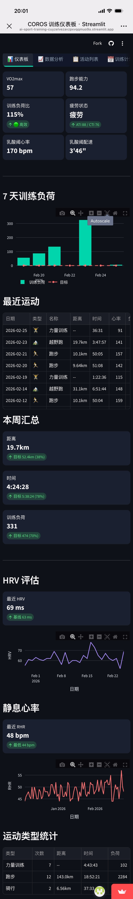
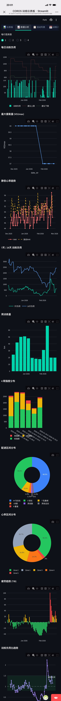
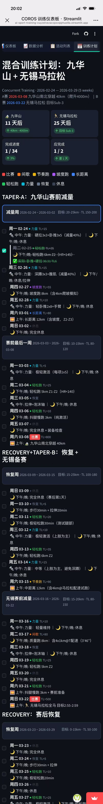

# COROS 训练仪表板

[](https://share.streamlit.io/deploy?repository=nametoa/ai-sport-training&branch=main&mainModule=streamlit_app.py)

基于 [COROS Team](https://t.coros.com) API 的个人训练数据可视化仪表板，使用 Streamlit 构建，支持一键云端部署和移动端访问。

> 适用于所有 COROS 手表用户，只需一个 COROS Team 账号即可使用。

## 截图预览

<p align="center">



</p>

> 从左到右：仪表板（指标 + 图表）、数据分析（多维图表）、训练计划（Todolist + 自动打卡）

## 功能特性

- **仪表板** — VO2max、跑步能力、训练负荷比、疲劳状态、乳酸阈心率/配速等核心指标一览
- **数据分析** — 每日训练负荷、7天/28天负荷趋势、VO2max曲线、配速/心率区间分布、强度分布等图表（支持 2/3/4 列切换）
- **活动列表** — 全部运动记录，支持按类型筛选、多维度排序、分页浏览
- **训练计划** — 周计划视图，每日 Todolist，根据 COROS 实际运动数据自动完成打卡，支持 Markdown/JSON 导出
- **自动同步** — 每次打开页面自动增量拉取最新 COROS 数据
- **移动端适配** — 手机/平板响应式布局，随时随地查看

## 快速开始

### 方式一：Streamlit Cloud 一键部署（推荐）

1. **Fork** 本仓库到你的 GitHub 账号
2. 打开 [share.streamlit.io](https://share.streamlit.io) → **New app** → **Deploy a public app from GitHub**
3. 填写：
   - **Repository**: `你的用户名/ai-sport-training`
   - **Branch**: `main`
   - **Main file path**: `streamlit_app.py`
4. 点击 **Advanced settings** → **Secrets**，粘贴你的 COROS 凭据（[获取方法见下方](#如何获取-coros-凭据)）：

```toml
[coros]
access_token = "你的 accesstoken"
user_id = "你的 userId"
cookie_wbkfro = "你的 _c_WBKFRo cookie 值"
cookie_region = "2"
```

5. 点击 **Deploy!**，等待 1-2 分钟即可访问

### 方式二：本地运行

```bash
# 1. 克隆仓库
git clone https://github.com/nametoa/ai-sport-training.git
cd ai-sport-training

# 2. 安装依赖
pip install -r requirements.txt

# 3. 配置凭据
cp .streamlit/secrets.toml.example .streamlit/secrets.toml
# 编辑 .streamlit/secrets.toml，填入你的 COROS 凭据

# 4. 启动
python3 -m streamlit run streamlit_app.py
```

打开 http://localhost:8501 即可访问。应用启动时会自动从 COROS 同步最新数据。

## 如何获取 COROS 凭据

你需要从 COROS Team 网页版获取 4 个参数：

1. 用浏览器打开 [t.coros.com](https://t.coros.com) 并登录
2. 按 **F12** 打开开发者工具，切换到 **Network（网络）** 标签
3. 刷新页面，点击任意一个发往 `teamcnapi.coros.com` 的请求
4. 在请求详情中找到：

| 参数 | 在哪里找 | 示例 |
|------|---------|------|
| `access_token` | Request Headers → `accesstoken` | `ZIJP093M3N6W...` |
| `user_id` | Request Headers → `yfheader` → `userId` | `429371112820850688` |
| `cookie_wbkfro` | Cookies → `_c_WBKFRo` | `41qS3hvxy4bl...` |
| `cookie_region` | Cookies → `CPL-coros-region`（通常是 `2`） | `2` |

> **注意**：COROS 的 token 会过期，如果数据拉取失败，请重新登录 t.coros.com 获取新的凭据并更新。

## 自定义训练计划

训练计划定义在 `streamlit_app.py` 的 `PLAN_PHASES` 变量中。你可以根据自己的比赛和训练目标修改：

```python
PLAN_PHASES = [
    {
        "name": "你的训练阶段名称",
        "tag": "PHASE-TAG",
        "weeks": [
            {
                "label": "第X周",
                "dates": ("2026-03-01", "2026-03-07"),
                "target_km": "30-40km",
                "target_tl": "200-300",
                "days": [
                    {
                        "date": "2026-03-01",
                        "wd": "周一",
                        "am": "上午训练内容",
                        "noon": "中午训练内容",
                        "pm": "下午/晚上训练内容",
                        "tl": 50,           # 预估训练负荷
                        "type": "easy_run",  # 训练类型
                    },
                    # ... 更多天
                ],
            },
        ],
    },
]
```

支持的训练类型：`race`（比赛）、`interval`（间歇）、`tempo_run`（节奏跑）、`hill_run`（坡度跑）、`long_run`（长距离）、`easy_run`（轻松跑）、`strength`（力量）、`recovery`（恢复）、`rest`（休息）

## AI 教练

项目包含 `ai_coach_prompt.md`，这是一份 AI 训练教练的提示词模板。你可以将其复制到 ChatGPT / Claude / Copilot 中，结合你的 COROS 数据获取个性化训练建议。

## 项目结构

```
ai-sport-training/
├── streamlit_app.py            # Streamlit 主应用（仪表板 + 分析 + 活动 + 计划）
├── fetch_coros_data.py         # COROS Team API 数据拉取脚本（增量更新）
├── ai_coach_prompt.md          # AI 教练提示词模板
├── requirements.txt            # Python 依赖
├── .streamlit/
│   ├── config.toml             # Streamlit 暗色主题配置
│   └── secrets.toml.example    # 凭据配置模板
└── data/                       # 运行时数据目录（自动创建，不提交到 Git）
    ├── activities.json         # 活动记录
    ├── analyse.json            # 每日分析数据
    ├── dashboard.json          # 仪表板汇总数据
    └── fetch_meta.json         # 同步状态元数据
```

## 技术栈

- **[Streamlit](https://streamlit.io/)** — Web 应用框架
- **[Plotly](https://plotly.com/python/)** — 交互式图表
- **[Pandas](https://pandas.pydata.org/)** — 数据处理
- **[Requests](https://requests.readthedocs.io/)** — HTTP 请求

## FAQ

**Q: 数据多久更新一次？**
A: 每次打开页面（或每个新 session）自动增量同步一次。也可以手动运行 `python3 fetch_coros_data.py`。

**Q: Token 过期了怎么办？**
A: 重新登录 [t.coros.com](https://t.coros.com)，按上方步骤获取新的凭据，更新 `.streamlit/secrets.toml`（本地）或 Streamlit Cloud 的 Secrets 设置。

**Q: 支持哪些运动类型？**
A: 跑步、越野跑、骑行、力量训练、游泳、健步、瑜伽等 COROS 支持的所有运动类型。

**Q: 可以在手机上使用吗？**
A: 可以。页面已适配移动端，直接用手机浏览器访问 Streamlit Cloud 部署的链接即可。

**Q: 部署到 Streamlit Cloud 是免费的吗？**
A: 是的。Streamlit Community Cloud 免费支持无限公开应用。

## License

MIT
